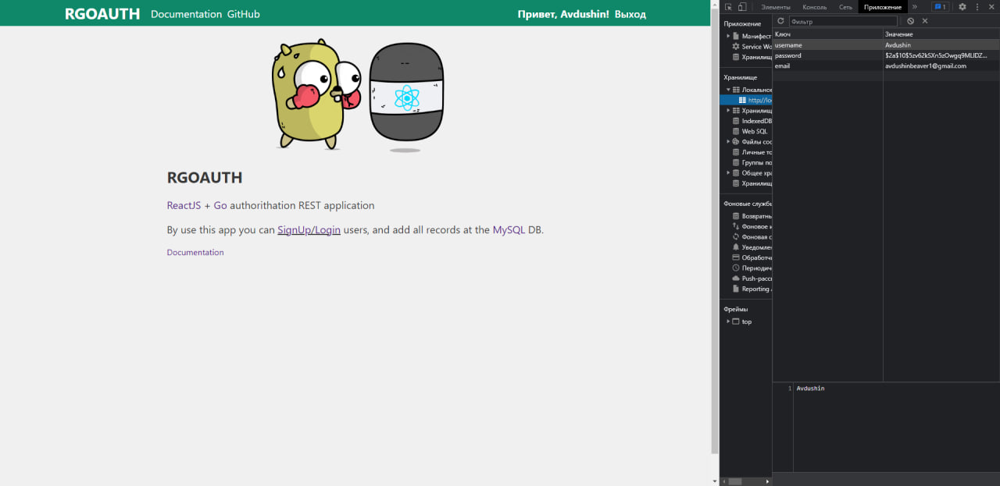

# RGOAUTH

[](https://youtu.be/t2KiHOXKsUA)

<!-- [](https://youtu.be/t2KiHOXKsUA) [DEMO]() -->

<div align="center">
  <a href="https://youtu.be/t2KiHOXKsUA" target="_blank">
    
  </a>
  <a href="https://youtu.be/t2KiHOXKsUA" target="_blank">
    DEMO
  </a>
</div> <br>

### REST-API авторизации ReactJS + Go + MySQL.
### Данная утилита является хуком для написания REST AUTH. Все данные хранятся в `localStorage()` (локальном хранилище)


## Heandlers

<details>
  <summary><code>/</code> heandler </summary>
  
  ### main page
  
\
  

  ### loggined user
\

  
</details>

<details>
  <summary><code>/login</code> heandler </summary>

  `/login` heandler


### After authorization, the password is hashed
\
  
  
</details>

<details>
  <summary><code>/signup</code> heandler </summary>

### `/signup` heandler 
\

  
</details>

<details>
  <summary><code>/api/users/:id</code> heandler </summary>

### User profile
\


### Edit user profile
\


### Validation
\


</details>

## БД

<details>
  <summary>База данных</summary>

### Таблицы


### Таблица Users
  
структура:


пример:


</details>


## How to start?

```bash
# frontend
cd frontend
npm -i
npm start

# backend
cd backend
# build app
go build -o server main.go # make build
# or start server
go run main.go # make
```

## Installing

```bash
gi clone https://github.com/Avdushin/RGOAUTH

# frontend
cd frontend
npm -i
npm start

# backend
cd ../backend
# build app
go build -o server main.go # make build
# start server
./server
```

## TODO

- [x] Make automatic BD backup
- [x] Edit user
- [x] ssl support
- [x] debug client
- [ ] Delete user
- [ ] vite + ReactJS client
- [ ] responsive client