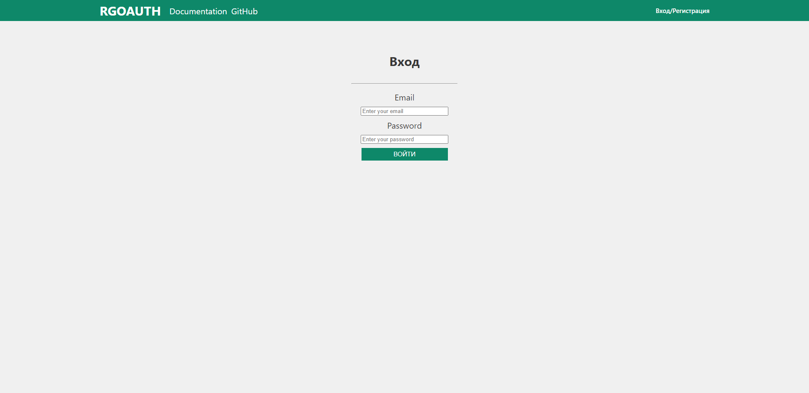
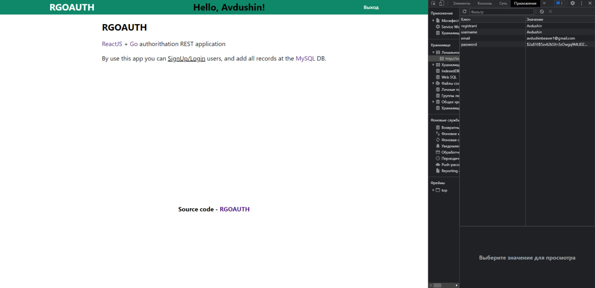

# RGOAUTH

### REST-API авторизации ReactJS + Go + MySQL.
### Данная утилита является хуком для написания REST AUTH. Все данные хранятся в `localStorage()` (локальном хранилище)


## Heandlers

<details>
  <summary><code>/</code> heandler </summary>
  
  ### main page
  
\
  

  ### loggined user
\

  
</details>

<details>
  <summary><code>/login</code> heandler </summary>

  `/login` heandler


### After authorization, the password is hashed
\
  
  
</details>

<details>
  <summary><code>/signup</code> heandler </summary>

### `/signup` heandler 
\


  
</details>


## How to start?

```bash
# frontend
cd frontend
npm -i
npm start

# backend
cd backend
# build app
go build -o server main.go # make build
# or start server
go run main.go # make
```

## Installing

```bash
gi clone https://github.com/Avdushin/RGOAUTH

# frontend
cd frontend
npm -i
npm start

# backend
cd ../backend
# build app
go build -o server main.go # make build
# start server
./server
```

## TODO

- improve backend architecture
- improve client styles
- responsive client
- debug client